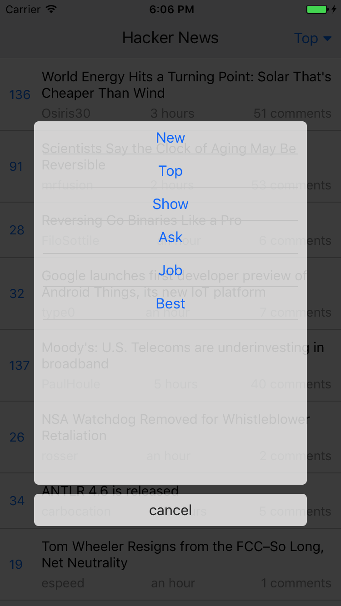
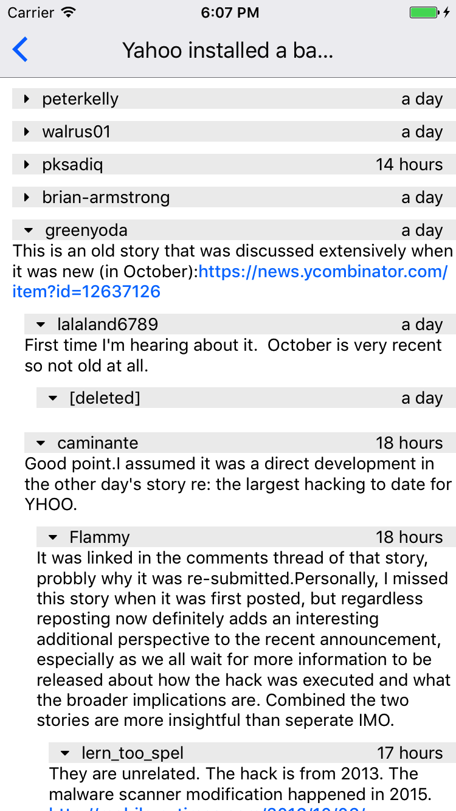

## Yet Another Hacker News Client

A Hacker News client made with React Native and Redux. Consumes HN's public API located at Firebase.

This was done purely as a learning exercise. If you find any bugs, please open an issue.

### Screenshots

Story Listing             |  Story Type Selection
:-------------------------:|:-------------------------:
  |  

Single Story            |  Threaded Comments | Toggleable Comments
:-------------------------:|:-------------------------:|:---------
  |     |  

### Installation

1. Clone this repository or download the ZIP.
2. `cd` into the downloaded project directory.
3. Run `npm install` to install all necessary packages.
4. Now run `react-native link` for setting up.

To run it on Android, run `react-native run-android` and for iOS `react-native run-ios`.

### Source Structure

- `index.ios.js` - Entry point for iOS.
- `index.android.js` - Entry point for Android.
- `src/` - All React Native code is located in this directory.
    - `assets/` - Contains helper files.
        - `colors.js` - Contain all colors in a central place.
    - `components/` - Contains general and re-usable components that aren't bound to global state. Dumb components.
        - `Comment.js` - To display a single comment.
        - `CommentList.js` - To display an array of comments. Works in tandem with `Comment.js` and they recursively call each other to draw out all parent and child comments.
        - `DisplayExternalLink.js` - To display any link provided to it. Clicking on it opens it in the Web Browser.
        - `HTMLRenderer.js` - Render HTML Text as a native component.
        - `LinkPreview.js` - To show a small preview of the story right on the single story screen.
        - `LoadingSpinner.js`
        - `NavbarMenuButton.js` - Opens a modal and provides the user with a list of options they can choose from. Used to switch between story types on the application header.
        - `StoryItem.js` - Display a single story item and its details either on the Story Listing screen or single story screen.
        - `TimeAgo.js` - Take a UNIX timestamp and convert it to '8 hours ago' format.
    - `config/` - Application configuration.
        - `api.js` - API URL's.
        - `firebase.js` - Setting up the Firebase connection.
    - `containers/` - Contains components that are bound to global state. Smart Components.
        - `Comments.js` - Comments container which calls the `CommentList.js` component to display all the comments. Bound to the global state and also manages the fetching of comments for a certain story. Called from `SingleStoryItem.js` component.
        - `Router.js` - Helps manage the navigation between various screens in the application and also provides the Header and the Navbar Switch to switch between story types (Top, Show, Ask, Best, Job, New).
        - `SingleStoryItem.js` - Screen for a single story item which displays item details and comments on it.
        - `StoryList.js` - Screen for all stories of a certain type (Top, Show, Ask, Best, Job, New).
    - `network/` - All network calls are made through this layer.
        - `api.js` - Exposes functions used to fetch content from Firebase. Does all the talking to Firebase.
    - `redux` - All *actions* and *reducers* are located here.
        - `actions` - Contains all application wide actions.
        - `reducers` - Contains all reducers.
        - `types.js` - keeps track of all action types that can be undertaken.
    - `App.js` - Unified entry point to the React Native application. This is what `index.ios.js` or `index.android.js` call and setup.

### Details

1. The application bootstraps in `App.js` and hands over the navigation to the `src/containers/Router.js` component.
2. This `Router.js` container helps manage the navigation between various screens in the application and also provides the Header and the Navbar Switch to switch between story types (Top, Show, Ask, Best, Job, New). It does so using the excellent `react-native-router-flux` package.
    - The navbar switch to switch between story types is setup inside the `src/containers/StoryList.js` component bootstrapped in the `changeStoryType` function as we only require it on the main story listing screen.
3. The screen that loads by default is the `src/containers/StoryList.js` component and it loads all stories of a certain type ('Top') by default.
4. A click on a certain story triggers the `src/containers/SingleStoryItem.js` component which loads the comments of a certain story and shows more details about it.
